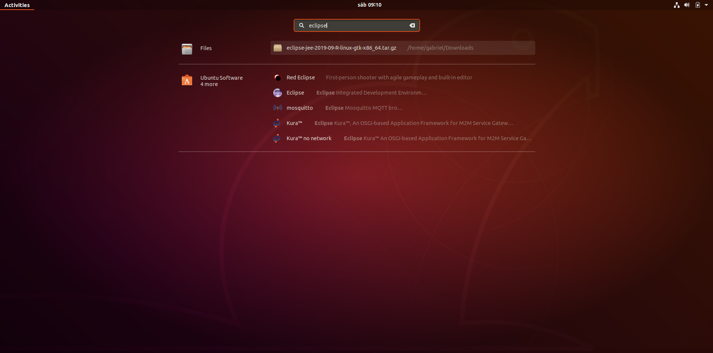
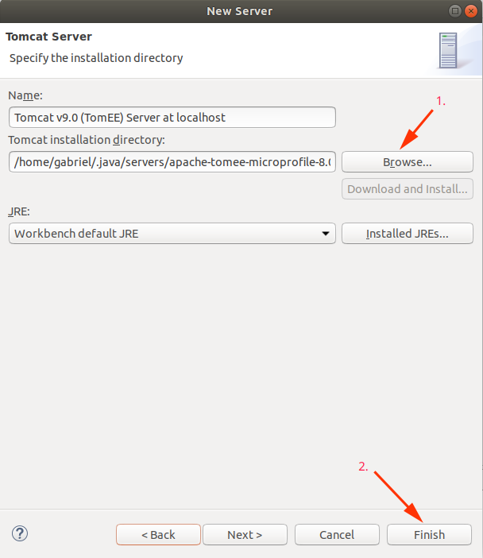
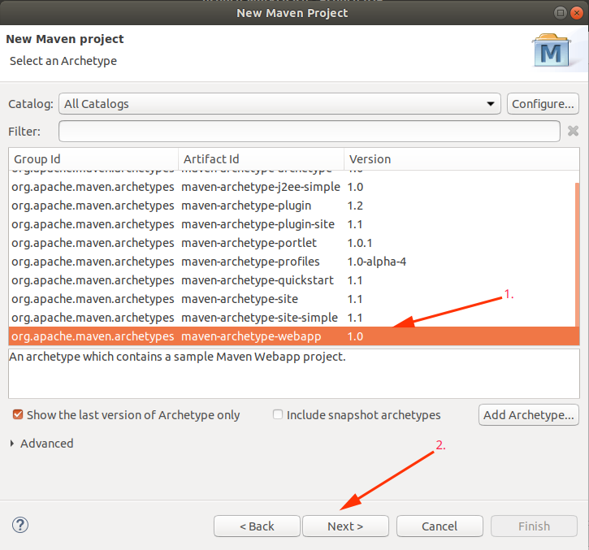

What's up, folks?!

So, in this post, I want to show you how to set up a Jakarta EE development in a clean Linux (Ubuntu) installation. We will set up Java and Maven from a version manager tool called SDKMAN, the Eclipse IDE and the TomEE Application Server.

## SDKMAN

First of all, we need to download the Java Development Kit (JDK). Because <a href="https://docs.oracle.com/javase/specs/index.html" markdown="1" target="_blank">Java and the Java Virtual Machine (JVM) are specifications</a> we have some implementations for it, like Amazon Correto, OpenJDK, OracleJDK and many others, for this tutorial, we will use the AdoptOpenJDK. 

We can install this manually, downloading the package and configuring the `$JAVA_HOME` and `$PATH` variables, but figuring that we might be working with the last Java version today (JDK13) but we have another project with JDK8, so how can we manage this versions on our system without having to configure every JDK swap ?

The answer is: <a href="https://sdkman.io/" markdown="1" target="_blank">SDKMAN.io</a>

SDKMAN is a "Software Development Kit Manager", it helps us manage multiples Java versions on our system, not just Java but Scala, Gradle, Maven, and much other stuff, I think that's why this they call themselves "The Software Development Kit Manager" haha.

So, let's install SDKMAN! It's very easy, just type on your terminal:

`curl -s "https://get.sdkman.io" | bash`

Now we have the SDKMAN but we have to open another instance of our terminal or just type `source "$HOME/.sdkman/bin/sdkman-init.sh"` on the same terminal. OK, if we do all this thing correct we will see that after type `sdk version` on terminal:


## Installing Java

Cool, now we can install java, type this command in your terminal:

`sdk install java`


This will install the last LTS java version in your pc. You can confirm the installation typing `java -version`.


Yeah!

## Installing Maven

Just like we did with Java, we can do with Maven, SDKMAN not just help us with Java but as we said earlier it can control Maven too, so just type in your terminal

`sdk install maven`


As you know (or not :stuck_out_tongue_winking_eye: ), Maven is our primary dependency manager, but, more than this Maven "is a software project management and comprehension tool" because it not only control our dependencies but helps us to automate our builds and organize our project with modules and others stuffs.

## Setting up Eclipse IDE

Cool, now we have Java and Maven, let's install our IDE! Go to the <a href="https://www.eclipse.org/" markdown="1" target="_blank">Eclipse Foundation homepage</a> and click in "download".


The Eclipse Foundation provides us an installer, but I will show you how to install manually, so click in "Download packages".


Select your OS, in my case, is a Linux.


Now just click in "download" and put your file whenever you want, I will put in the "Downloads" folder.


A cool thing about this package is that it would just extract, and click in the `eclipse` binary inside the folder, but well are organized, we will put it in the  `/usr/local/share` where some third party application is located. Lest extract it with this command:

`sudo tar -zxvf eclipse-jee-2019-09-R-linux-gtk-x86_64.tar.gz -C /usr/local/share/`


If we search in the menu (on Ubuntu in my case), we will not find a shortcut to the IDE (just to install through Ubuntu Store).



We need to create a `.desktop` file and install it on our system, according to <a href="https://developer.gnome.org/integration-guide/stable/desktop-files.html.en" markdown="1" target="_blank">Gnome documentation</a> :

> This desktop file contains a listing of the configurations for your application. The desktop takes the information in this file and uses it to:
> - put the application in the Main Menu. To find a list of valid categories, take a look into FreeDesktop.org's Desktop Menu Specification.
> - list the application in the Run Application... dialog
> - creates appropriate launchers in the menu or on the desktop.
> - associate the name and description of the application.
> - use the appropriate icon.
> - recognize the MIME types it supports for opening files.

Just create an `eclipse.desktop` file and put this inside:
```
[Desktop Entry]
Name=Eclipse
Type=Application
Exec=/usr/local/share/eclipse/eclipse
Terminal=false
Icon=/usr/local/share/eclipse/icon.xpm
Comment=Integrated Development Environment
NoDisplay=false
Categories=Development;IDE;
Name[en]=Eclipse
Name[en_US]=Eclipse
```


With this, we can "install" our desktop file pasting it on our `/usr/share/applications/` directory for all users on our system or we can put in our `~/.local/share/applications/` directory for just the current user has access. I will put in `/usr/share/applications/` with `sudo mv eclipse.desktop /usr/share/applications/`.


Now if we click on the menu we can see our Eclipse IDE, yeah!


Just an observation, if you put on `/usr/share/applications/` folder you will lose the `$JAVA_HOME` reference because we just have it as a local variable in our profile, and `/usr/share/applications/` is a system-wide folder. To see that you can type `printenv`, you will see the `$JAVA_HOME` variable, but if you type `sudo printenv` you don't see.

`prinenv`


`sudo prinenv`


So if you try to open Eclipse will see this message.


To correct this just specify where is your current JDK on `eclipse.ini` file adding your `$JAVA_HOME` path at the file above the `-vmargs` like this:

Discovering the `$JAVA_PATH` with `echo` command:


```
-vm
/home/gabriel/.sdkman/candidates/java/current/bin/java
```


## Adding TomEE to the IDE

Now last, but not least, let's download and configure our TomEE application server on our IDE.
The Apache TomEE is like an Apache Tomcat with steroids, not that is better but it implements all the Jakarta EE specifications. If we need to use EJB, JAAS or JAX-RS, for example, we need an Application Server that implements these specifications. <a href="http://tomee.apache.org/comparison.html" markdown="1" target="_blank">Here is a comparison table between Tomcat and some TomEE versions</a>.

Let's download it, go to the TomEE homepage and click in "download" at the menu.


Now we can select one of the options, in this case, I will download the "microprofile" version.


We can put whenever we want the file, but I will download in the "Download" folder and will extract it in another place, `~/.java/servers/` just for organization reasons. To unzip the file use:

`unzip apache-tomee-8.0.0-microprofile.zip -d ~/.java/servers/`


Cool, just for testing purposes we can start TomEE through the terminal, navigate to the Apache TomEE root folder and execute the `./startup.sh` in the `bin` folder, and execute `./shutdown.sh` to stop the server.

Let's add the server on our IDE, open the IDE and click on "Click this link to create a new server.." at the "Servers" tab.


Find the Apache folder and search by "Tomcat v9.0 Server". We can modify the "Server name" just to identify it as a JavaEE application server. Click on "next" after this.


Now we have to find where is our TomEE folder, in my case `/home/gabriel/.java/servers/apache-tomee-microprofile-8.0.0`. After that click in "finish".



YEAH BOY! That's it!

## Creating a simple web project to test our configs

Just for test lets create a simple Java Web Application and put into our server to see this beautiful thing happens! :stuck_out_tongue_winking_eye:

Go to "File > New > Maven Project" and next.


Select the "maven-archetype-webapp" and then click next.



Now define a group name (your URL backward is a convention), a name for your final artifact and finish.


Maven will download some dependencies and plugins, after that we can add our project on our TomEE Application Server and start it :smile:


After that, go to `http://localhost:8080/awesome-java-web/` on your browser and you will see something like that (or not :stuck_out_tongue_closed_eyes:)!


That's all folks, I hope you enjoyed this article! 

Feel free to ask something at comments. 